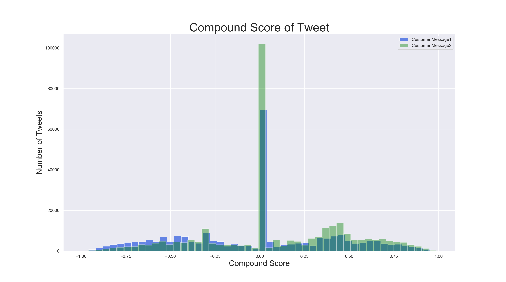

## Sentiment Analysis around Customer Support on Twitter
There are so many ways to find out how customers feel about your brand and products, and sentiment analysis is extremely useful in monitoring your customer’s perception. The dataset used for this exploratory analysis project was obtained from [Kaggle](https://www.kaggle.com/thoughtvector/customer-support-on-twitter), it consists of 2.8 million tweets between customers and companies. The goal is to analyze the tone in the conversation on Twitter between customers and companies by looking at a variety of different features. 
 
## Question
"Does the initial outreach message from a company result in an increase in positive sentiment from the customer?"

## Overview
### Data Wrangling
To best be able to answer my question above I decided to split my dataset into customer tweets and company tweets. An assumption was made that any author with a numeric value in ``` 'author_id' ``` is a customer and any author with text such as ``` 'AmazonHelp' ``` is a company.
<p><p>

| Unique Companies | Unique Customers | Total Unique Twitter Accounts |
:--: | :--: | :--: 
| 108 | 702,669 | 702,777 | 
<p><p>

Once I had the customer and company dataframes I needed to work on finding the flow of converstations:
<p><p>

- ``` Customer Message1 ``` The very first customer message to the company
- ``` Company Message1 ``` The companies response to message above
- ``` Customer Message2 ``` The customer's response to message above

We start by looking at the customer dataset and find **Customer Message1** by looking for all tweets that have ``` NaN ``` in ```in_response_to_tweet_id```. Then from there we can look at the corresponding ```response_tweet_id``` then match those in the Company dataframe under ```tweet_id``` and that will give us **Company Message1**. Next we match the ```response_tweet_id``` to the ```tweet_id``` back in the customer dataframe to find **Customer Message2**.

### Dates
Looking at the dates of these tweets our dataset has a range of dates from 2008 to 2018, when looking at the scatter plot of tweets we can see the majority of our dataset is in the year 2017.


When we take a closer at just dates from September 2017 and on we can see the spread much better.


One major question I had, was how fast are companies responding on Twitter? I looked at the time.

**TO DO**

## Sentiment Analysis
With many different choices available to use for sentiment analysis I needed to find something that could use our unlabeled text and classify each Tweet as positive, neutral, or negative. I decided to use the [VADER]([[https://github.com/cjhutto/vaderSentiment](https://github.com/cjhutto/vaderSentiment)) library. VADER stands for Valence Aware Dictionary for sEntiment Reasoning (they really forced the E to work there) and is specifically tuned for social media expressions.

What makes VADER special is its ability to use text sentiment and be sensitive to both polarity and intensity of emotion in text. It is able to recognize that “happy” has a different meaning than when it is paired with “not” and it can also understand the emphasis of capitalization in words and differentiate “LOVE” from “love” in its final score of that word.

### About the scoring system in VADER:
Each tweet is given a percentage of being “negative” “neutral” or “positive” and also a "compound score." The compound score is computed by summing the valence scores of each word in the lexicon, adjusted according to the rules, and then normalized to be between -1 (most extreme negative) and +1 (most extreme positive). This is the most useful metric if you want a single unidimensional measure of sentiment for a given sentence. Calling it a 'normalized, weighted composite score' is accurate. *[CREDIT](https://github.com/cjhutto/vaderSentiment#about-the-scoring)

We can view the compound score of each tweet with Customer Message1 in blue and Customer Message2 (after the company responded) in green.



## Text Analysis
Next we will explore the top words used in each Customer message.


## Hypothesis Testing
I decided to conduct a series of hypothesis tests to determine the following:
1. "Does the initial outreach message from a company result in an increase in positive sentiment from the customer?"

Ho: After the company responds to message 1 from the customer, the second message from the customer will have an increase in postive sentiment.
Ha: After the company responds to message 1 from the customer, theThe second message from the customer will not have an increase in postive sentiment.

Sample Sizes:

Message1 Sentiment vs. Message2 Sentiment

p-value / t-test results

2. "If the company responds within **X hours, does that result in an increase in postive sentiment from the customer?"

Ho: 
Ha: 

Sample Sizes:

Message1 Sentiment vs. Message2 Sentiment

p-value / t-test results

## Conclusions